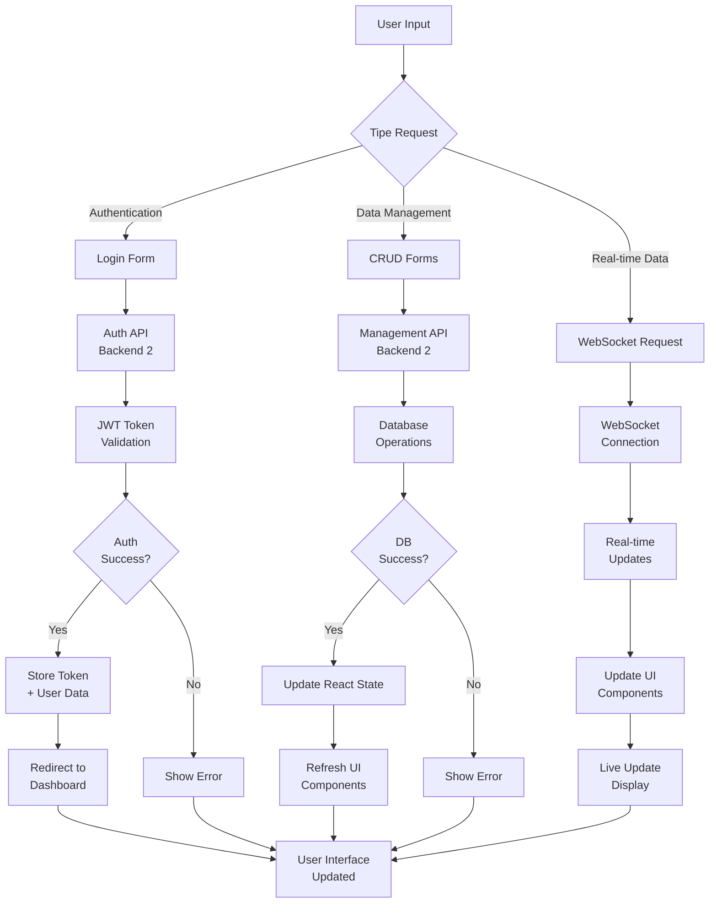
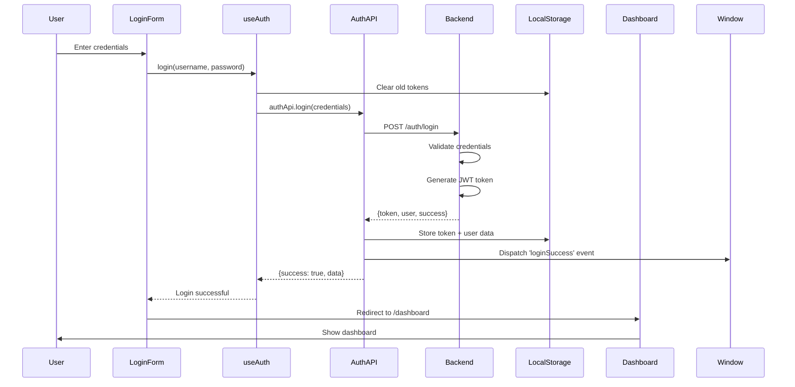
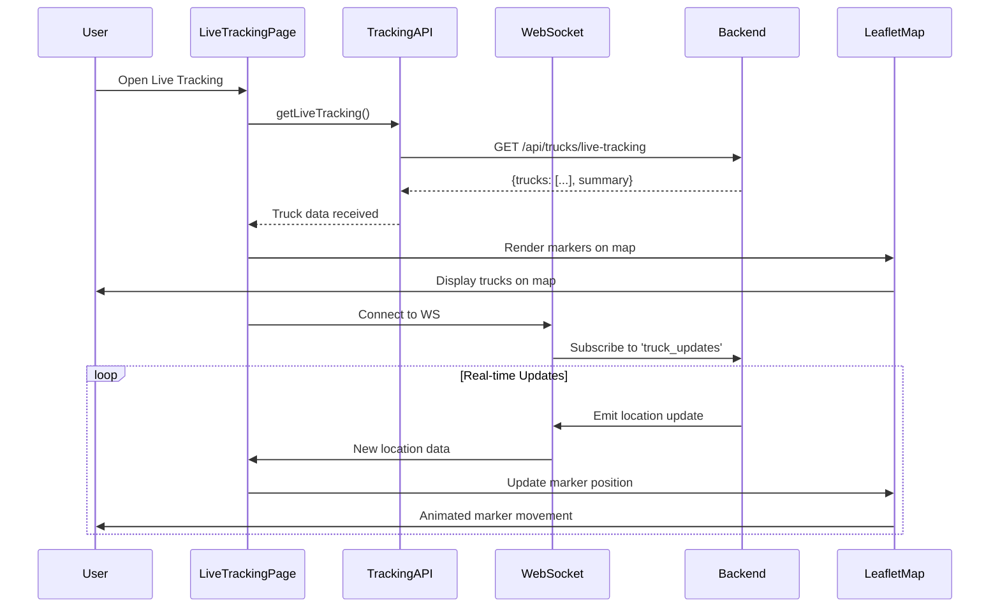
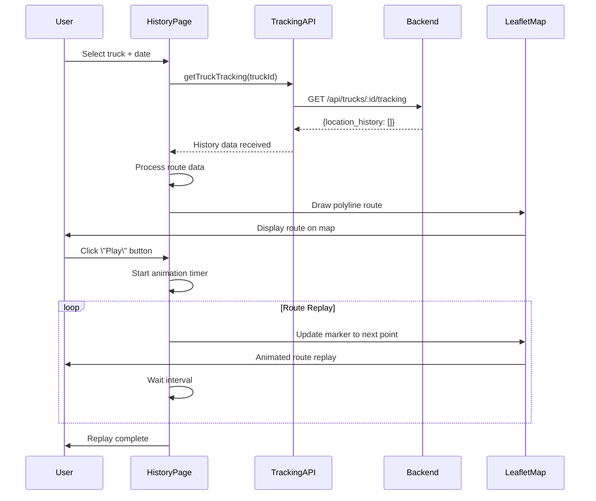
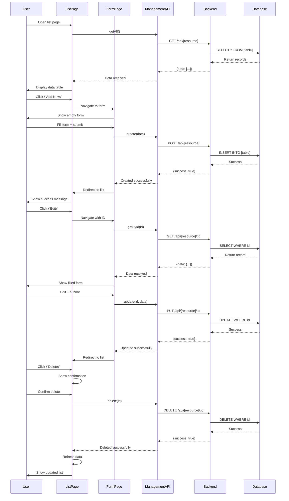
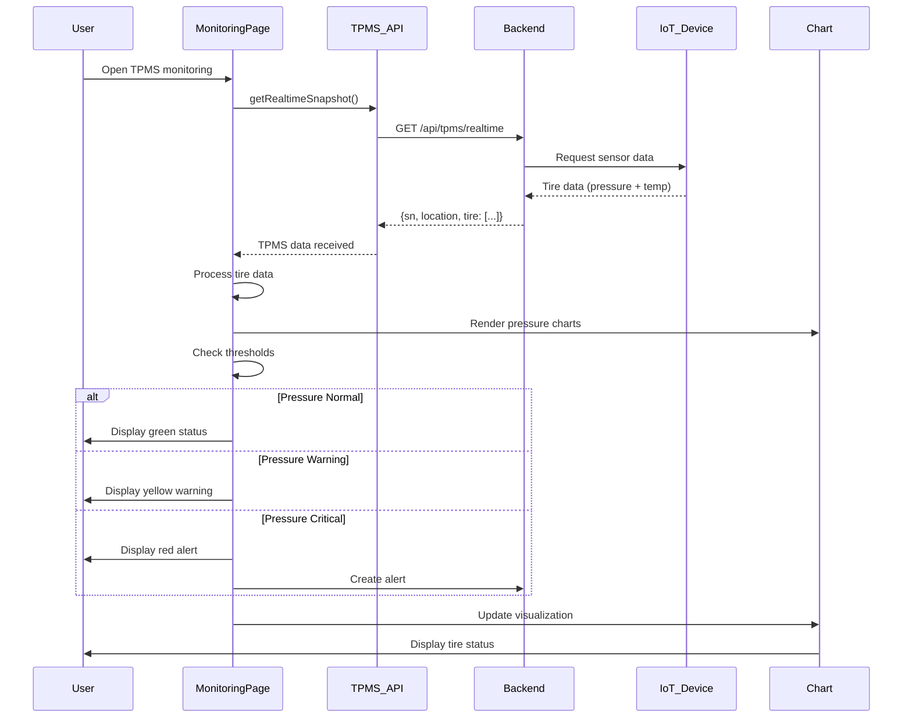
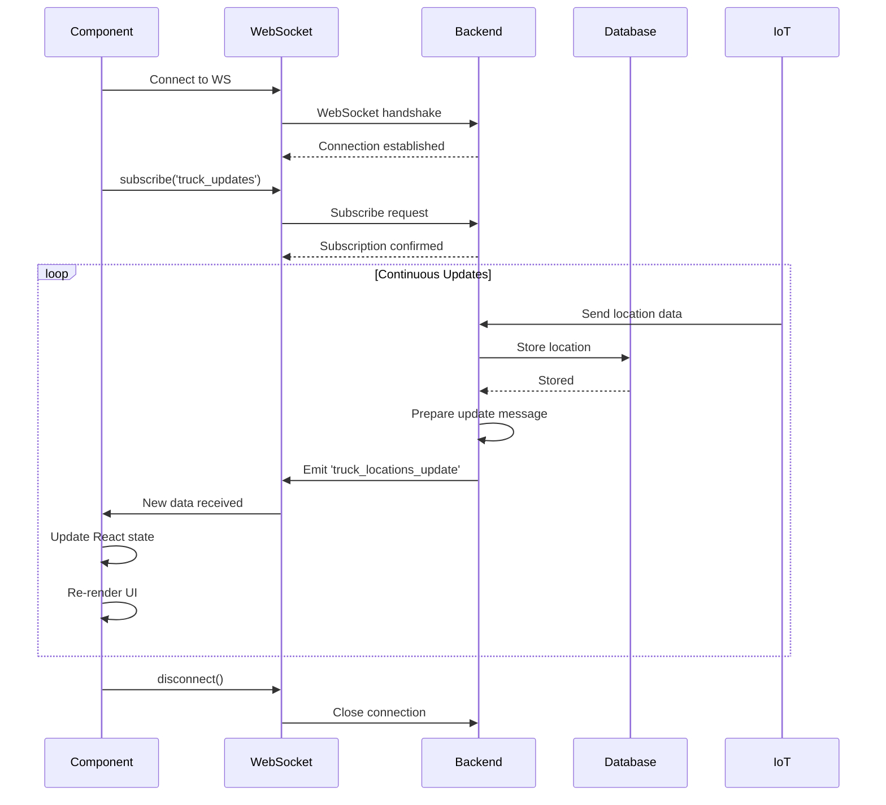

"# 📚 DOKUMENTASI APLIKASI TRUCK TRACKING SYSTEM

## 📖 Daftar Isi

1. [Gambaran Umum](#gambaran-umum)
2. [Arsitektur Sistem](#arsitektur-sistem)
3. [Diagram Alur Kerja](#diagram-alur-kerja)
4. [Dokumentasi Fitur](#dokumentasi-fitur)
5. [Struktur Proyek](#struktur-proyek)
6. [API Endpoints](#api-endpoints)
7. [Teknologi yang Digunakan](#teknologi-yang-digunakan)
8. [Cara Menjalankan Aplikasi](#cara-menjalankan-aplikasi)

---

## 🎯 Gambaran Umum

**Borneo Indobara Truck Tracking System** adalah aplikasi web berbasis React untuk manajemen armada dan pelacakan kendaraan secara real-time yang dirancang khusus untuk industri pertambangan dan transportasi.

### Tujuan Aplikasi
- Memantau posisi kendaraan secara real-time menggunakan GPS
- Monitoring kondisi ban (tekanan dan suhu) dengan TPMS (Tire Pressure Monitoring System)
- Manajemen data armada (kendaraan, driver, sensor, perangkat IoT)
- Analisis dan pelaporan riwayat perjalanan kendaraan
- Sistem notifikasi untuk anomali dan peringatan

### Jenis Aplikasi
**Frontend-only Application** - Aplikasi ini adalah frontend React yang berkomunikasi dengan 2 backend eksternal:
- **Backend 1 (Tracking API)**: Menangani GPS tracking, TPMS, dan telemetry
- **Backend 2 (Management API)**: Menangani master data dan fleet management

---

## 🏗️ Arsitektur Sistem

### Gambaran Arsitektur

```
┌─────────────────────────────────────────────────────────────┐
│                     TRUCK TRACKING SYSTEM                    │
│                      (React Frontend)                        │
└─────────────────────────────────────────────────────────────┘
                              │
                              │
        ┌─────────────────────┴─────────────────────┐
        │                                           │
        ▼                                           ▼
┌──────────────────┐                      ┌──────────────────┐
│   Backend 1      │                      │   Backend 2      │
│  Tracking API    │                      │ Management API   │
│                  │                      │                  │
│ • Live Tracking  │                      │ • Authentication │
│ • History Track  │                      │ • Master Data    │
│ • TPMS Data      │                      │ • Fleet Mgmt     │
│ • Telemetry      │                      │ • Dashboard      │
│                  │                      │ • Alerts         │
└──────────────────┘                      └──────────────────┘
        │                                           │
        │                                           │
        ▼                                           ▼
┌──────────────────┐                      ┌──────────────────┐
│   IoT Devices    │                      │    Database      │
│                  │                      │   (MongoDB)      │
│ • GPS Trackers   │                      │                  │
│ • TPMS Sensors   │                      │ • Users          │
│ • Fuel Sensors   │                      │ • Trucks         │
│ • Temp Sensors   │                      │ • Drivers        │
└──────────────────┘                      │ • Devices        │
                                          │ • Sensors        │
                                          │ • Vendors        │
                                          └──────────────────┘
```

### Komunikasi Protokol

1. **HTTP/REST API**
   - Frontend → Backend: AJAX requests via Axios
   - Authentication: Bearer Token (JWT)

2. **WebSocket**
   - Real-time updates untuk tracking dan alerts
   - Protokol: Socket.io Client

---

## 📊 Diagram Alur Kerja

### 1️⃣ Alur Kerja Umum (Input → Output)



### 2️⃣ Alur Autentikasi (Login Flow)



### 3️⃣ Alur Live Tracking



### 4️⃣ Alur History Tracking



### 5️⃣ Alur CRUD Operations (Fleet Management)



### 6️⃣ Alur Monitoring TPMS (Tire Pressure)



### 7️⃣ Alur WebSocket Real-time Updates



---

## 🎨 Dokumentasi Fitur

### 1. Authentication & Authorization

#### 📝 Deskripsi
Sistem autentikasi berbasis JWT (JSON Web Token) yang mengelola akses user ke aplikasi.

#### ✨ Fitur Utama
- **Login**: Form login dengan username dan password
- **JWT Token Management**: Token disimpan di localStorage
- **Protected Routes**: Otomatis redirect ke login jika belum autentikasi
- **Auto Logout**: Logout otomatis jika token expired (401 response)

#### 🔄 Alur Kerja
1. User memasukkan username dan password
2. Frontend mengirim credentials ke Backend 2: `POST /auth/login`
3. Backend memvalidasi dan generate JWT token
4. Token disimpan di localStorage dengan key `authToken` dan `token`
5. User data disimpan di localStorage dengan key `user`
6. Setiap API request, token ditambahkan di header: `Authorization: Bearer {token}`
7. Jika response 401, user di-logout dan redirect ke `/login`

#### 📁 File Terkait
- `/src/hooks/useAuth.js` - Custom hook untuk authentication
- `/src/components/auth/Login.jsx` - Komponen login form
- `/src/services/management/modules/auth/auth.api.js` - API authentication
- `/src/routes/ProtectedRoute.jsx` - Route guard untuk halaman protected

---

### 2. Dashboard

#### 📝 Deskripsi
Halaman utama yang menampilkan ringkasan dan statistik keseluruhan fleet.

#### ✨ Fitur Utama
- **Fleet Overview**: Total kendaraan, driver, sensor, perangkat
- **Status Summary**: Kendaraan aktif, idle, non-aktif
- **Alert Summary**: Alert aktif, resolved, critical
- **Charts & Graphs**: 
  - Fleet Status Chart (Pie Chart)
  - Vehicle Activity Chart (Bar Chart)
  - Alert Trends Chart (Line Chart)
- **Quick Stats Cards**: Statistik dengan icon dan trend indicators

#### 🔄 Alur Kerja
1. User login dan diarahkan ke `/dashboard`
2. Component Dashboard mount
3. Fetch dashboard statistics: `GET /api/dashboard/stats`
4. Fetch alert summary: `GET /api/monitoring/alerts/summary`
5. Render charts menggunakan Recharts
6. Display quick action buttons

#### 📊 Data yang Ditampilkan
- Total trucks, drivers, devices, sensors
- Active, idle, inactive vehicle counts
- Active alerts, resolved alerts, critical alerts
- Recent alerts list

#### 📁 File Terkait
- `/src/pages/Dashboard.jsx` - Komponen dashboard utama
- `/src/components/dashboard/TailwindStatCard.jsx` - Card statistik
- `/src/components/chart/` - Berbagai komponen chart
- `/src/services/management/modules/monitoring/dashboard.api.js` - API dashboard

---

### 3. Live Tracking

#### 📝 Deskripsi
Pelacakan posisi kendaraan secara real-time menggunakan peta interaktif dengan update otomatis via WebSocket.

#### ✨ Fitur Utama
- **Interactive Map**: Peta berbasis Leaflet dengan zoom & pan
- **Real-time Markers**: Marker kendaraan yang bergerak secara real-time
- **Marker Clustering**: Grouping marker otomatis untuk banyak kendaraan
- **Vehicle Info Popup**: Info detail kendaraan saat click marker
- **Status Colors**: 
  - 🟢 Green: Active (bergerak)
  - 🟡 Yellow: Idle (diam > 5 menit)
  - 🔴 Red: Inactive (offline)
- **Vehicle Filtering**: Filter berdasarkan status, vendor, group
- **Auto-refresh**: Update posisi otomatis via WebSocket

#### 🔄 Alur Kerja
1. User membuka halaman `/live-tracking`
2. Component mount dan fetch initial data: `GET /api/trucks/live-tracking`
3. Render semua marker truck di peta
4. Connect ke WebSocket: `ws://[WS_URL]`
5. Subscribe ke channel: `truck_updates`
6. Terima update location via WebSocket
7. Update marker position dengan animasi smooth

#### 📊 Data yang Ditampilkan
- Truck ID, plate number, name, model, type
- Current location (latitude, longitude)
- Driver info (name, phone)
- Device info (serial number, status, battery)
- Sensor count dan status
- Last update timestamp

#### 📁 File Terkait
- `/src/pages/LiveTracking.jsx` - Halaman live tracking
- `/src/pages/tracking/LiveTrackingMapNew.jsx` - Komponen peta
- `/src/services/tracking/tracking.api.js` - API tracking
- `/src/services/websocket/FleetWebSocket.js` - WebSocket client

#### 🗺️ Map Features
- **Zoom Controls**: Zoom in/out
- **Layer Controls**: Pilihan base map (Street, Satellite)
- **Geolocation**: Center map ke lokasi user
- **Fullscreen**: Mode fullscreen untuk peta

---

### 4. History Tracking

#### 📝 Deskripsi
Menampilkan riwayat perjalanan kendaraan dengan route replay animation.

#### ✨ Fitur Utama
- **Route Visualization**: Polyline route di peta
- **Route Replay**: Animasi replay perjalanan kendaraan
- **Playback Controls**: 
  - Play/Pause button
  - Speed control (1x, 2x, 5x)
  - Progress slider
- **Time Markers**: Timestamp di setiap point
- **Distance Calculation**: Total jarak tempuh
- **Duration Display**: Total waktu perjalanan
- **Route Statistics**: 
  - Start & end location
  - Total distance
  - Duration
  - Average speed

#### 🔄 Alur Kerja
1. User membuka halaman `/history-tracking`
2. User memilih truck dari dropdown
3. User memilih date range
4. Fetch tracking history: `GET /api/trucks/:id/tracking`
5. Backend return semua location history points (tidak ada limit)
6. Frontend render polyline route di peta
7. User click \"Play\" untuk start replay animation
8. Marker bergerak mengikuti route dengan animasi

#### 📊 Data yang Ditampilkan
- Truck basic info
- Location history array (semua points dari backend)
- Each point: latitude, longitude, recorded_at, created_at
- Route statistics

#### 📁 File Terkait
- `/src/pages/HistoryTracking.jsx` - Halaman history tracking
- `/src/pages/tracking/HistoryTrackingMap.jsx` - Komponen peta history
- `/src/services/tracking/tracking.api.js` - API untuk fetch history

---

### 5. Fleet Management

#### 📝 Deskripsi
Manajemen master data armada termasuk trucks, drivers, devices, sensors, dan vendors.

#### ✨ Fitur Utama untuk Setiap Resource

##### 5.1. Trucks Management

**Fitur:**
- List semua kendaraan dengan pagination & search
- Add new truck dengan form detail
- Edit truck information
- Delete truck (dengan konfirmasi)
- View truck details
- Filter by vendor, type, status

**Data Fields:**
- Plate number (nomor polisi)
- Truck name
- Model & brand
- Type (Dump Truck, Cargo, etc.)
- Status (active, inactive, maintenance)
- Vendor/contractor
- Purchase date, manufacture year
- Notes

**API Endpoints:**
- `GET /api/fleet/trucks` - Get all trucks
- `GET /api/fleet/trucks/:id` - Get truck by ID
- `POST /api/fleet/trucks` - Create new truck
- `PUT /api/fleet/trucks/:id` - Update truck
- `DELETE /api/fleet/trucks/:id` - Delete truck

##### 5.2. Drivers Management

**Fitur:**
- List semua driver
- Add new driver
- Edit driver info
- Delete driver
- View driver details
- Search by name/license

**Data Fields:**
- Full name
- Phone number
- Email
- License number
- License type (SIM A, B, C)
- License expiry date
- Address
- Status (active, inactive)

**API Endpoints:**
- `GET /api/fleet/drivers` - Get all drivers
- `GET /api/fleet/drivers/:id` - Get driver by ID
- `POST /api/fleet/drivers` - Create new driver
- `PUT /api/fleet/drivers/:id` - Update driver
- `DELETE /api/fleet/drivers/:id` - Delete driver

##### 5.3. Devices Management (IoT Devices)

**Fitur:**
- List semua perangkat IoT
- Add new device
- Edit device info
- Delete device
- Assign device to truck
- View device status & battery

**Data Fields:**
- Device serial number
- Device type (GPS Tracker, TPMS Gateway)
- Brand & model
- Status (active, inactive, offline)
- Battery level
- Signal strength
- Last communication time
- Assigned truck
- Installation date

**API Endpoints:**
- `GET /api/iot/devices` - Get all devices
- `GET /api/iot/devices/:id` - Get device by ID
- `POST /api/iot/devices` - Create new device
- `PUT /api/iot/devices/:id` - Update device
- `DELETE /api/iot/devices/:id` - Delete device

##### 5.4. Sensors Management (TPMS Sensors)

**Fitur:**
- List semua sensor TPMS
- Add new sensor
- Edit sensor config
- Delete sensor
- Assign sensor to truck & tire position
- View sensor readings

**Data Fields:**
- Sensor ID
- Sensor serial number
- Sensor type (TPMS)
- Assigned truck
- Tire position (1-10)
- Status (active, inactive, faulty)
- Battery level
- Pressure threshold (min, max)
- Temperature threshold (min, max)
- Last reading time

**API Endpoints:**
- `GET /api/iot/sensors` - Get all sensors
- `GET /api/iot/sensors/:id` - Get sensor by ID
- `POST /api/iot/sensors` - Create new sensor
- `PUT /api/iot/sensors/:id` - Update sensor
- `DELETE /api/iot/sensors/:id` - Delete sensor

##### 5.5. Vendors Management

**Fitur:**
- List semua vendor/kontraktor
- Add new vendor
- Edit vendor info
- Delete vendor
- View vendor statistics (total trucks, drivers)

**Data Fields:**
- Vendor name
- Company name
- Contact person
- Phone number
- Email
- Address
- Contract start date
- Contract end date
- Status (active, inactive)
- Notes

**API Endpoints:**
- `GET /api/fleet/vendors` - Get all vendors
- `GET /api/fleet/vendors/:id` - Get vendor by ID
- `POST /api/fleet/vendors` - Create new vendor
- `PUT /api/fleet/vendors/:id` - Update vendor
- `DELETE /api/fleet/vendors/:id` - Delete vendor

#### 🔄 Alur Kerja Umum (CRUD)

**READ (List):**
1. User buka halaman list (e.g., `/trucks`)
2. Fetch data: `GET /api/[resource]`
3. Display data dalam table dengan pagination
4. Provide search & filter

**CREATE:**
1. User click \"Add New\" button
2. Navigate ke form page dengan mode \"create\"
3. User isi form
4. Submit: `POST /api/[resource]`
5. Success → redirect ke list page
6. Error → show error message

**UPDATE:**
1. User click \"Edit\" button di list
2. Navigate ke form page dengan mode \"edit\"
3. Fetch existing data: `GET /api/[resource]/:id`
4. Pre-fill form dengan data
5. User edit data
6. Submit: `PUT /api/[resource]/:id`
7. Success → redirect ke list page

**DELETE:**
1. User click \"Delete\" button
2. Show confirmation modal
3. User confirm
4. Delete: `DELETE /api/[resource]/:id`
5. Success → refresh list
6. Show success message

#### 📁 File Terkait
- `/src/pages/listdata/` - Semua list pages
- `/src/pages/form/` - Semua form pages
- `/src/services/management/modules/fleet/` - Fleet APIs
- `/src/services/management/modules/iot/` - IoT APIs

---

### 6. Monitoring System

#### 📝 Deskripsi
Sistem monitoring untuk berbagai sensor dan telemetry data kendaraan.

#### ✨ Fitur Monitoring

##### 6.1. Sensor Monitoring (TPMS)

**Deskripsi:**
Monitoring tekanan dan suhu ban secara real-time untuk semua kendaraan.

**Fitur:**
- Grid view semua kendaraan dengan sensor status
- Real-time pressure & temperature readings
- Color-coded status indicators:
  - 🟢 Normal: Dalam range aman
  - 🟡 Warning: Mendekati threshold
  - 🔴 Critical: Melebihi threshold
- Tire position visualization (10 tires)
- Historical pressure trends chart
- Alert generation untuk anomali

**Data yang Ditampilkan:**
- Tire pressure (kPa)
- Tire temperature (°C)
- Sensor battery level
- Last update time
- Status per tire

**API Endpoints:**
- `GET /api/tpms/realtime` - Get real-time TPMS data
- `GET /api/tpms/location` - Get TPMS history

##### 6.2. Fuel Monitoring

**Deskripsi:**
Monitoring konsumsi dan level bahan bakar kendaraan.

**Fitur:**
- Real-time fuel level display
- Fuel consumption rate
- Fuel efficiency calculation
- Daily/weekly/monthly consumption charts
- Fuel refill history
- Low fuel alerts

**Data yang Ditampilkan:**
- Current fuel level (liters)
- Fuel percentage
- Consumption rate (L/hour)
- Estimated range
- Refill events

##### 6.3. Temperature Monitoring

**Deskripsi:**
Monitoring suhu engine dan komponen kendaraan.

**Fitur:**
- Engine temperature display
- Temperature trend charts
- Overheat alerts
- Historical temperature data
- Temperature threshold configuration

**Data yang Ditampilkan:**
- Engine temperature
- Coolant temperature
- Ambient temperature
- Max/min temperature
- Alert status

##### 6.4. Live Tire View

**Deskripsi:**
Visualisasi real-time kondisi semua ban dalam satu tampilan.

**Fitur:**
- Visual tire representation (truck diagram)
- Color-coded tire status
- Click tire untuk detail
- Real-time updates
- Alert notifications

##### 6.5. Vehicle Device Status

**Deskripsi:**
Monitoring status dan kesehatan perangkat IoT di setiap kendaraan.

**Fitur:**
- Device connection status
- Signal strength indicator
- Battery level monitoring
- Last communication time
- Device health score
- Offline device alerts

**Data yang Ditampilkan:**
- Device online/offline status
- Signal strength (dBm)
- Battery level (%)
- Uptime
- Communication errors

#### 📁 File Terkait
- `/src/pages/monitoring/` - Semua monitoring pages
- `/src/services/tracking/tpms.api.js` - TPMS API
- `/src/services/tracking/monitoring.api.js` - Monitoring API
- `/src/components/chart/` - Chart components

---

### 7. Alerts System

#### 📝 Deskripsi
Sistem notifikasi dan alert untuk berbagai event dan anomali kendaraan.

#### ✨ Fitur Utama
- **Alert List**: Daftar semua alert dengan filtering
- **Alert Categories**:
  - 🚨 Critical: Alert kritis (tekanan ban sangat rendah, overheat)
  - ⚠️ Warning: Peringatan (tekanan mendekati threshold)
  - ℹ️ Info: Informasi umum
- **Alert Types**:
  - Tire pressure alert
  - Temperature alert
  - Fuel low alert
  - Device offline alert
  - Geofence alert
  - Speed alert
- **Real-time Notifications**: Alert muncul real-time via WebSocket
- **Alert Management**:
  - Mark as read
  - Resolve alert
  - Add notes
  - Assign to user
- **Alert History**: Riwayat semua alert
- **Alert Statistics**: Chart dan summary

#### 🔄 Alur Kerja
1. IoT device mengirim data anomali ke backend
2. Backend detect anomali berdasarkan threshold
3. Backend create alert di database
4. Backend emit alert via WebSocket
5. Frontend receive alert dan show notification
6. Alert ditampilkan di alert list
7. User dapat view detail dan resolve alert

#### 📊 Data Alert
- Alert ID
- Alert type & severity
- Truck info
- Sensor/device info
- Alert message
- Timestamp
- Status (active, resolved)
- Resolved by & resolved time
- Notes

#### 📁 File Terkait
- `/src/pages/listdata/Alerts.jsx` - Alert list page
- `/src/services/management/modules/monitoring/alerts.api.js` - Alerts API
- `/src/hooks/useAlertNotifications.js` - Alert notifications hook

---

### 8. Analytics & Reports

#### 📝 Deskripsi
Analisis data dan laporan untuk decision making.

#### ✨ Fitur Analytics
- **Fleet Performance**: Analisis performa armada
- **Driver Performance**: Analisis performa driver
- **Fuel Efficiency**: Analisis efisiensi bahan bakar
- **Maintenance Schedule**: Jadwal maintenance prediktif
- **Cost Analysis**: Analisis biaya operasional

#### ✨ Fitur Reports
- **Daily Report**: Laporan harian operasional
- **Weekly Summary**: Ringkasan mingguan
- **Monthly Report**: Laporan bulanan
- **Custom Reports**: Laporan custom dengan filter
- **Export Options**: Export ke PDF, Excel, CSV

#### 📁 File Terkait
- `/src/pages/Analytics.jsx` - Analytics page
- `/src/pages/Reports.jsx` - Reports page

---

### 9. Settings

#### 📝 Deskripsi
Pengaturan aplikasi dan konfigurasi sistem.

#### ✨ Fitur Settings
- **User Profile**: Edit profile user
- **Change Password**: Ganti password
- **Notification Settings**: Pengaturan notifikasi
- **Alert Thresholds**: Konfigurasi threshold alert
- **Map Settings**: Preferensi peta
- **System Settings**: Pengaturan sistem (admin only)

#### 📁 File Terkait
- `/src/pages/Settings.jsx` - Settings page

---

## 📂 Struktur Proyek

```
/app/
├── public/                         # Static assets
│   ├── icon.jpg
│   └── icon2.png
│
├── src/
│   ├── components/                 # Reusable components
│   │   ├── auth/                  # Authentication components
│   │   │   └── Login.jsx
│   │   ├── chart/                 # Chart components (Recharts)
│   │   │   ├── AlertTrendsChart.jsx
│   │   │   ├── FleetStatusChart.jsx
│   │   │   ├── TirePressureChart.jsx
│   │   │   └── ...
│   │   ├── common/                # Common UI components
│   │   │   ├── AlertModal.jsx
│   │   │   ├── Button.jsx
│   │   │   ├── DatePicker.jsx
│   │   │   ├── DropdownMenu.jsx
│   │   │   ├── ErrorBoundary.jsx
│   │   │   └── TruckImage.jsx
│   │   ├── dashboard/             # Dashboard specific components
│   │   │   ├── TailwindStatCard.jsx
│   │   │   ├── TailwindFleetOverview.jsx
│   │   │   └── TirePressureDisplay.jsx
│   │   ├── layout/                # Layout components
│   │   │   ├── TailwindLayout.jsx
│   │   │   ├── TailwindHeader.jsx
│   │   │   └── TailwindSidebar.jsx
│   │   └── icons/                 # Custom icon components
│   │       └── WheelFrontIcon.jsx
│   │
│   ├── pages/                     # Page components
│   │   ├── Dashboard.jsx
│   │   ├── LiveTracking.jsx
│   │   ├── HistoryTracking.jsx
│   │   ├── Analytics.jsx
│   │   ├── Reports.jsx
│   │   ├── Settings.jsx
│   │   ├── FleetManagement.jsx
│   │   ├── MasterData.jsx
│   │   │
│   │   ├── form/                  # Form pages (Create/Edit)
│   │   │   ├── TruckForm.jsx
│   │   │   ├── DriverForm.jsx
│   │   │   ├── SensorForm.jsx
│   │   │   ├── DeviceForm.jsx
│   │   │   └── VendorForm.jsx
│   │   │
│   │   ├── listdata/              # List/Table pages
│   │   │   ├── TrucksList.jsx
│   │   │   ├── DriversList.jsx
│   │   │   ├── Sensors.jsx
│   │   │   ├── Devices.jsx
│   │   │   ├── VendorsList.jsx
│   │   │   └── Alerts.jsx
│   │   │
│   │   ├── monitoring/            # Monitoring pages
│   │   │   ├── SensorMonitoring.jsx
│   │   │   ├── FuelMonitoring.jsx
│   │   │   ├── TemperatureMonitoring.jsx
│   │   │   ├── TirePressureMonitoring.jsx
│   │   │   ├── LiveTireView.jsx
│   │   │   └── VehicleDeviceStatus.jsx
│   │   │
│   │   └── tracking/              # Tracking map components
│   │       ├── BaseTrackingMap.jsx
│   │       ├── LiveTrackingMapNew.jsx
│   │       └── HistoryTrackingMap.jsx
│   │
│   ├── services/                  # API services
│   │   ├── management/            # Backend 2 (Management API)
│   │   │   ├── config.js         # Management API config
│   │   │   ├── websocket.js      # WebSocket client
│   │   │   ├── base/
│   │   │   └── modules/
│   │   │       ├── auth/         # Authentication API
│   │   │       │   └── auth.api.js
│   │   │       ├── fleet/        # Fleet management APIs
│   │   │       │   ├── trucks.api.js
│   │   │       │   ├── drivers.api.js
│   │   │       │   └── vendors.api.js
│   │   │       ├── iot/          # IoT device APIs
│   │   │       │   ├── devices.api.js
│   │   │       │   └── sensors.api.js
│   │   │       ├── monitoring/   # Monitoring APIs
│   │   │       │   ├── dashboard.api.js
│   │   │       │   └── alerts.api.js
│   │   │       └── operations/
│   │   │
│   │   ├── tracking/              # Backend 1 (Tracking API)
│   │   │   ├── config.js         # Tracking API config
│   │   │   ├── tracking.api.js   # Live & history tracking
│   │   │   ├── tpms.api.js       # TPMS sensor data
│   │   │   ├── monitoring.api.js # Monitoring telemetry
│   │   │   └── history.api.js
│   │   │
│   │   ├── websocket/             # WebSocket clients
│   │   │   └── FleetWebSocket.js
│   │   │
│   │   └── index.js               # Service exports
│   │
│   ├── hooks/                     # Custom React hooks
│   │   ├── useAuth.js            # Authentication hook
│   │   ├── useApi2.js            # API hook
│   │   ├── useAlert.js           # Alert hook
│   │   └── useAlertNotifications.js  # Alert notifications
│   │
│   ├── routes/                    # Route configuration
│   │   ├── index.jsx             # Main routes
│   │   ├── ProtectedRoute.jsx    # Protected route guard
│   │   └── PublicRoute.jsx       # Public route guard
│   │
│   ├── App.jsx                    # Main App component
│   ├── main.jsx                   # Entry point
│   ├── App.css                    # App styles
│   └── index.css                  # Global styles
│
├── screenshots/                    # App screenshots
├── test-data/                      # Sample test data (CSV)
│
├── package.json                    # Dependencies
├── vite.config.js                  # Vite configuration
├── tailwind.config.js              # Tailwind configuration
├── eslint.config.js                # ESLint configuration
├── .env.example                    # Environment variables example
└── README.md                       # Project documentation
```

---

## 🌐 API Endpoints

### Backend 1 (Tracking API)
Base URL: `VITE_TRACKING_API_BASE_URL`

#### Live Tracking
```
GET /api/trucks/live-tracking
Response: {
  success: true,
  data: {
    trucks: [...],
    summary: { total_trucks, trucks_with_location }
  }
}
```

#### History Tracking
```
GET /api/trucks/:id/tracking
Response: {
  success: true,
  data: {
    truck_id, plate_number, location_history: [...]
  }
}
```

#### TPMS Real-time
```
GET /api/tpms/realtime
Headers: Authorization: Bearer {token}
Response: {
  message: \"Realtime data retrieved successfully\",
  data: [{ sn, location, tire: [...] }]
}
```

#### TPMS History
```
GET /api/tpms/location
Headers: Authorization: Bearer {token}
Response: {
  message: \"Location data retrieved successfully\",
  data: [{ sn, location: [...] }]
}
```

### Backend 2 (Management API)
Base URL: `VITE_API_BASE_URL`

#### Authentication
```
POST /auth/login
Body: { username, password }
Response: {
  success: true,
  data: { token, user }
}

POST /auth/logout
Headers: Authorization: Bearer {token}
```

#### Dashboard
```
GET /api/dashboard/stats
Headers: Authorization: Bearer {token}
Response: {
  data: {
    total_trucks, total_drivers, active_trucks,
    alerts: { active, resolved }
  }
}
```

#### Trucks
```
GET /api/fleet/trucks
GET /api/fleet/trucks/:id
POST /api/fleet/trucks
PUT /api/fleet/trucks/:id
DELETE /api/fleet/trucks/:id

Headers: Authorization: Bearer {token}
```

#### Drivers
```
GET /api/fleet/drivers
GET /api/fleet/drivers/:id
POST /api/fleet/drivers
PUT /api/fleet/drivers/:id
DELETE /api/fleet/drivers/:id

Headers: Authorization: Bearer {token}
```

#### Devices
```
GET /api/iot/devices
GET /api/iot/devices/:id
POST /api/iot/devices
PUT /api/iot/devices/:id
DELETE /api/iot/devices/:id

Headers: Authorization: Bearer {token}
```

#### Sensors
```
GET /api/iot/sensors
GET /api/iot/sensors/:id
POST /api/iot/sensors
PUT /api/iot/sensors/:id
DELETE /api/iot/sensors/:id

Headers: Authorization: Bearer {token}
```

#### Vendors
```
GET /api/fleet/vendors
GET /api/fleet/vendors/:id
POST /api/fleet/vendors
PUT /api/fleet/vendors/:id
DELETE /api/fleet/vendors/:id

Headers: Authorization: Bearer {token}
```

#### Alerts
```
GET /api/monitoring/alerts
GET /api/monitoring/alerts/summary
GET /api/monitoring/alerts/:id
PUT /api/monitoring/alerts/:id/resolve

Headers: Authorization: Bearer {token}
```

### WebSocket Events

#### Backend 2 WebSocket
URL: `VITE_WS_URL`

**Subscribe:**
```javascript
{
  type: 'subscribe',
  data: { channel: 'truck_updates' }
}
```

**Events:**
- `truck_locations_update` - Update lokasi kendaraan
- `truck_updates` - Update data kendaraan
- `new_alerts` - Alert baru
- `alert_resolved` - Alert resolved
- `dashboard_update` - Update dashboard

---

## 🛠️ Teknologi yang Digunakan

### Frontend Framework & Libraries
| Teknologi | Versi | Fungsi |
|-----------|-------|--------|
| **React** | 19.1.1 | UI Library |
| **React Router** | 7.8.2 | Client-side routing |
| **Vite** | 7.1.2 | Build tool & dev server |
| **Tailwind CSS** | 4.1.12 | Utility-first CSS framework |

### Maps & Visualization
| Teknologi | Versi | Fungsi |
|-----------|-------|--------|
| **Leaflet** | 1.9.4 | Interactive maps library |
| **React Leaflet** | 5.0.0 | React bindings for Leaflet |
| **Leaflet Polyline Decorator** | 1.6.0 | Route decorations |
| **Recharts** | 3.5.1 | Chart library |

### State Management & API
| Teknologi | Versi | Fungsi |
|-----------|-------|--------|
| **Axios** | 1.11.0 | HTTP client |
| **Socket.io Client** | 4.8.1 | WebSocket communication |

### UI Components & Icons
| Teknologi | Versi | Fungsi |
|-----------|-------|--------|
| **Lucide React** | 0.540.0 | Icon library |
| **Headless UI** | 2.2.7 | Unstyled accessible components |
| **Heroicons** | 2.2.0 | Icon set |

### Developer Tools
| Teknologi | Versi | Fungsi |
|-----------|-------|--------|
| **ESLint** | 9.35.0 | Code linting |
| **Prettier** | 3.6.2 | Code formatting |
| **SWC** | - | Fast refresh |

### Utilities
| Teknologi | Versi | Fungsi |
|-----------|-------|--------|
| **UUID** | 11.1.0 | Generate unique IDs |

---

## 🚀 Cara Menjalankan Aplikasi

### Prasyarat
```bash
Node.js: v22.18.0
npm atau yarn
```

### Instalasi

1. **Clone Repository**
```bash
git clone https://github.com/JosinBahaswan/Truck-Tracking.git
cd Truck-Tracking
```

2. **Install Dependencies**
```bash
# Menggunakan npm
npm install

# Atau menggunakan yarn
yarn install
```

3. **Konfigurasi Environment Variables**

Buat file `.env` di root directory:
```env
# Backend 2 - Management API
VITE_API_BASE_URL=http://your-backend-2-url/api
VITE_WS_URL=ws://your-backend-2-url

# Backend 1 - Tracking API
VITE_TRACKING_API_BASE_URL=http://your-backend-1-url/api

# TPMS API
VITE_API_TPMS_REALTIME_ENDPOINT=http://your-tpms-url/api/tpms/realtime
VITE_API_TPMS_LOCATION_ENDPOINT=http://your-tpms-url/api/tpms/location
VITE_TPMS_WS_URL=ws://your-tpms-url
```

4. **Jalankan Development Server**
```bash
# Menggunakan npm
npm run dev

# Atau menggunakan yarn
yarn dev
```

Aplikasi akan berjalan di: `http://localhost:5173`

5. **Build untuk Production**
```bash
# Menggunakan npm
npm run build

# Atau menggunakan yarn
yarn build
```

File build akan tersimpan di folder `dist/`

6. **Preview Production Build**
```bash
# Menggunakan npm
npm run preview

# Atau menggunakan yarn
yarn preview
```

---

## 📝 Catatan Penting

### Environment Variables
Aplikasi ini membutuhkan 2 backend yang terpisah:
- **Backend 1 (Tracking)**: Untuk GPS tracking dan TPMS
- **Backend 2 (Management)**: Untuk master data dan fleet management

Pastikan semua environment variables sudah dikonfigurasi dengan benar.

### Authentication
- Token JWT disimpan di `localStorage` dengan key `authToken` dan `token`
- User data disimpan di `localStorage` dengan key `user`
- Token otomatis ditambahkan di header setiap request
- Auto-logout jika token expired (401 response)

### WebSocket Connection
- WebSocket connect otomatis saat aplikasi load
- Reconnect otomatis jika koneksi terputus
- Maximum 5 reconnect attempts

### Browser Support
- Chrome (recommended)
- Firefox
- Safari
- Edge
- Tidak support IE11

---

## 📞 Kontak & Support

Untuk pertanyaan, bug report, atau feature request:
- **Repository**: https://github.com/JosinBahaswan/Truck-Tracking
- **Developer**: Josin Bahaswan

---

## 📄 License

Private - PT Borneo Indobara

---

**Dokumentasi ini dibuat pada:** Januari 2025  
**Versi Aplikasi:** 0.0.0  
**Terakhir diupdate:** Januari 2025
"