"# 📊 DIAGRAM ALUR KERJA - TRUCK TRACKING SYSTEM

Dokumen ini berisi berbagai diagram alur kerja untuk sistem Truck Tracking dari input hingga output backend.

---

## 📌 Daftar Diagram

1. [Diagram Arsitektur Sistem](#1-diagram-arsitektur-sistem)
2. [Alur Kerja Umum (Input → Output)](#2-alur-kerja-umum-input--output)
3. [Alur Autentikasi (Login)](#3-alur-autentikasi-login)
4. [Alur Live Tracking](#4-alur-live-tracking)
5. [Alur History Tracking](#5-alur-history-tracking)
6. [Alur CRUD Operations](#6-alur-crud-operations)
7. [Alur Monitoring TPMS](#7-alur-monitoring-tpms)
8. [Alur WebSocket Real-time](#8-alur-websocket-real-time)
9. [Alur Data Flow Lengkap](#9-alur-data-flow-lengkap)

---

## 1. Diagram Arsitektur Sistem


---

## 2. Alur Kerja Umum (Input → Output)

### Diagram Alur

```mermaid
graph TD
    A[👤 User Input] --> B{Jenis Request?}
    
    B -->|Login/Auth| C[📝 Form Login]
    B -->|CRUD Data| D[📋 Form Management]
    B -->|Real-time| E[🔄 WebSocket Request]
    B -->|View Data| F[📊 Fetch Request]
    
    C --> G[Auth API<br/>POST /auth/login]
    D --> H[Management API<br/>CRUD Endpoints]
    E --> I[WebSocket Connection<br/>Subscribe Channel]
    F --> J[REST API<br/>GET Request]
    
    G --> K[Backend 2<br/>Auth Service]
    H --> L[Backend 2<br/>Management Service]
    I --> M[Backend 2<br/>WebSocket Server]
    J --> N{Tracking<br/>atau<br/>Management?}
    
    N -->|Tracking| O[Backend 1<br/>Tracking API]
    N -->|Management| L
    
    K --> P{Credentials<br/>Valid?}
    P -->|✅ Yes| Q[Generate JWT Token]
    P -->|❌ No| R[Return Error]
    
    Q --> S[Store in localStorage]
    S --> T[Update React State]
    T --> U[Redirect to Dashboard]
    
    L --> V[Database Operations]
    V --> W{DB<br/>Success?}
    W -->|✅ Yes| X[Return Data]
    W -->|❌ No| Y[Return Error]
    
    X --> Z[Update UI State]
    Y --> AA[Show Error Message]
    
    O --> AB[Get Tracking Data]
    AB --> AC[Process Data]
    AC --> Z
    
    M --> AD[Real-time Updates]
    AD --> AE[Update Components]
    
    R --> AA
    U --> AF[✅ Success Display]
    Z --> AF
    AE --> AF
    AA --> AF
    
    AF[🖥️ User Interface Updated]

    style A fill:#e1f5ff
    style AF fill:#e1ffe1
    style P fill:#fff4e1
    style W fill:#fff4e1
```



### Penjelasan Alur

1. **User Input**: User memberikan input melalui interface (form, button, dll)
2. **Routing**: Request diklasifikasikan berdasarkan jenis (auth, CRUD, real-time, view)
3. **API Call**: Frontend mengirim request ke backend yang sesuai
4. **Backend Processing**: Backend memproses request (validasi, database operation, dll)
5. **Response**: Backend mengirim response (success atau error)
6. **State Update**: Frontend update React state dengan data baru
7. **UI Update**: Component re-render dan tampilkan data terbaru

---

## 3. Alur Autentikasi (Login)


### Detail Proses

**Step 1-2: User Input**
- User mengisi form dengan username dan password
- Click button \"Login\"

**Step 3-6: Frontend Processing**
- LoginForm call `useAuth` hook
- Hook clear localStorage untuk hapus token lama
- Call AuthAPI untuk kirim credentials
- Axios buat HTTP POST request

**Step 7-10: Backend Validation**
- Backend terima request
- Query database untuk cari user
- Verify password dengan bcrypt
- Validasi credentials

**Step 11-15: Token Generation (Success Path)**
- Generate JWT token dengan payload user info
- Return token + user data ke frontend
- Frontend store di localStorage
- Dispatch event 'loginSuccess'

**Step 16-22: UI Update**
- Update React state (isAuthenticated, user)
- Redirect ke dashboard
- Dashboard load dengan user data

---

## 4. Alur Live Tracking


### Komponen Data Live Tracking

**Initial Data Load:**
```javascript
{
  success: true,
  data: {
    trucks: [
      {
        truck_id: 1,
        plate_number: \"B 9001 SIM\",
        truck_name: \"Simulator Truck SIM01\",
        status: \"active\",
        location: {
          latitude: -3.567821,
          longitude: 115.647158,
          recorded_at: \"2025-01-15T10:30:00Z\"
        },
        driver: { name, phone },
        device: { serial_number, battery },
        sensors: [...]
      }
    ],
    summary: {
      total_trucks: 50,
      trucks_with_location: 48
    }
  }
}
```

**WebSocket Update Message:**
```javascript
{
  type: 'truck_locations_update',
  data: {
    truck_id: 1,
    location: {
      latitude: -3.567900,
      longitude: 115.647200,
      recorded_at: \"2025-01-15T10:30:15Z\"
    },
    speed: 45,
    status: \"active\"
  }
}
```

---

## 5. Alur History Tracking


### Data Structure History

**Request:**
```http
GET /api/trucks/1/tracking HTTP/1.1
Authorization: Bearer {token}
```

**Response (All History - No Limit):**
```javascript
{
  success: true,
  data: {
    truck_id: 1,
    plate_number: \"B 9001 SIM\",
    current_location: {
      latitude: -3.567821,
      longitude: 115.647158,
      recorded_at: \"2025-01-15T14:30:00Z\"
    },
    location_history: [
      // All points from backend - could be 1000+ points
      {
        latitude: -3.577821,
        longitude: 115.645158,
        recorded_at: \"2025-01-15T08:00:00Z\"
      },
      {
        latitude: -3.576821,
        longitude: 115.647158,
        recorded_at: \"2025-01-15T08:03:00Z\"
      },
      // ... hundreds or thousands more points ...
      {
        latitude: -3.567821,
        longitude: 115.647158,
        recorded_at: \"2025-01-15T14:30:00Z\"
      }
    ],
    statistics: {
      total_points: 1234,
      total_distance_km: 156.7,
      duration_hours: 6.5,
      average_speed_kmh: 24.1
    }
  }
}
```

---

## 6. Alur CRUD Operations

### Create Operation


### Read Operation


### Update Operation


### Delete Operation


---

## 7. Alur Monitoring TPMS


### TPMS Data Structure

**Real-time Data:**
```javascript
{
  message: \"Realtime data retrieved successfully\",
  count: 1,
  data: [
    {
      sn: \"812952426\",
      location: {
        lat_lng: \"-3.567821, 115.647158\",
        createdAt: \"2025-01-15T10:30:00.049Z\"
      },
      tire: [
        {
          tireNo: 1,
          tiprValue: 223.3,  // kPa
          tempValue: 35.1,    // °C
          createdAt: \"2025-01-15T10:30:00.123Z\"
        },
        // ... tires 2-10
      ]
    }
  ]
}
```

**Threshold Configuration:**
```javascript
const THRESHOLDS = {
  pressure: {
    min: 200,      // kPa
    max: 250,      // kPa
    critical_min: 150,
    critical_max: 280
  },
  temperature: {
    normal_max: 50,  // °C
    warning_max: 60,
    critical_max: 70
  }
};
```

---

## 8. Alur WebSocket Real-time


### WebSocket Message Types

**Subscription Request:**
```javascript
{
  type: 'subscribe',
  data: {
    channel: 'truck_updates'
  }
}
```

**Location Update:**
```javascript
{
  type: 'truck_locations_update',
  data: {
    truck_id: 1,
    location: {
      latitude: -3.567821,
      longitude: 115.647158,
      recorded_at: \"2025-01-15T10:30:00Z\"
    },
    speed: 45,
    status: \"active\"
  },
  timestamp: \"2025-01-15T10:30:00Z\"
}
```

**Alert Notification:**
```javascript
{
  type: 'new_alerts',
  data: {
    alert_id: \"uuid\",
    truck_id: 1,
    alert_type: \"tire_pressure\",
    severity: \"critical\",
    message: \"Tire 3 pressure critically low\",
    created_at: \"2025-01-15T10:30:00Z\"
  }
}
```

---

## 9. Alur Data Flow Lengkap


---

## 📝 Penjelasan Komponen

### 1. IoT Layer
- **GPS Tracker**: Mengirim koordinat lokasi setiap 3-5 detik
- **TPMS Sensors**: Monitor tekanan dan suhu ban (10 sensors per truck)
- **Fuel Sensor**: Monitor level dan konsumsi bahan bakar
- **Temperature Sensor**: Monitor suhu engine dan komponen

### 2. Backend 1 (Tracking API)
- **IoT Gateway**: Menerima dan validasi data dari IoT devices
- **Location Service**: Process dan store GPS data
- **TPMS Service**: Process sensor data dan detect anomali
- **Telemetry Service**: Aggregate telemetry data

### 3. Backend 2 (Management API)
- **REST API Server**: Handle HTTP requests (CRUD operations)
- **WebSocket Server**: Handle real-time connections
- **Auth Service**: JWT authentication dan authorization
- **Fleet Service**: Manage trucks, drivers, devices
- **Alert Service**: Generate dan manage alerts

### 4. Database Layer (MongoDB)
- **Locations**: Store GPS coordinates dan tracking history
- **TPMS Data**: Store tire pressure dan temperature readings
- **Trucks**: Master data kendaraan
- **Users**: User accounts dan permissions
- **Alerts**: Alert records dan history

### 5. Frontend (React)
- **Login Page**: Authentication interface
- **Dashboard**: Overview dan statistics
- **Live Tracking**: Real-time map dengan WebSocket
- **History Tracking**: Route replay dengan animation
- **Monitoring**: TPMS, fuel, temperature monitoring
- **Fleet Management**: CRUD interfaces untuk master data

---

## 🔄 Request/Response Flow Summary

### HTTP Request Flow
```
User Action → Component → API Service → Axios → Backend → Database
```

### HTTP Response Flow
```
Database → Backend → Axios → API Service → Component → UI Update
```

### WebSocket Flow
```
IoT Device → Backend → WebSocket Server → WebSocket Client → Component → UI Update
```

### Real-time Update Cycle
```
1. IoT sends data (every 3-5s)
2. Backend receives & stores
3. Backend emits to WebSocket
4. Frontend receives update
5. React state updated
6. Component re-renders
7. User sees change
```

---

## 📊 Performance Metrics

### Typical Response Times
- **Authentication**: 200-500ms
- **CRUD Operations**: 100-300ms
- **Live Tracking (initial)**: 500-1000ms
- **History Tracking**: 1-2s (depending on data volume)
- **TPMS Data**: 300-600ms
- **WebSocket Update**: <100ms

### Data Volumes
- **Live Tracking**: 50-100 trucks simultaneously
- **History Points**: No limit (could be 1000s per truck)
- **TPMS Sensors**: 10 sensors per truck
- **WebSocket Messages**: 1 update per truck per 3-5 seconds

---

## 🔐 Security Measures

### Authentication
1. JWT Token with 24h expiration
2. Token stored in localStorage
3. Token sent in Authorization header
4. Auto-logout on 401 response

### Authorization
1. Role-based access control (RBAC)
2. Protected routes in React Router
3. Backend API endpoint protection
4. WebSocket connection authentication

### Data Protection
1. HTTPS for all HTTP requests
2. WSS (Secure WebSocket) for real-time data
3. Input validation on frontend & backend
4. SQL injection prevention (parameterized queries)
5. XSS protection (React auto-escaping)

---

**Diagram Created:** Januari 2025  
**Version:** 1.0.0  
**Last Updated:** Januari 2025
"